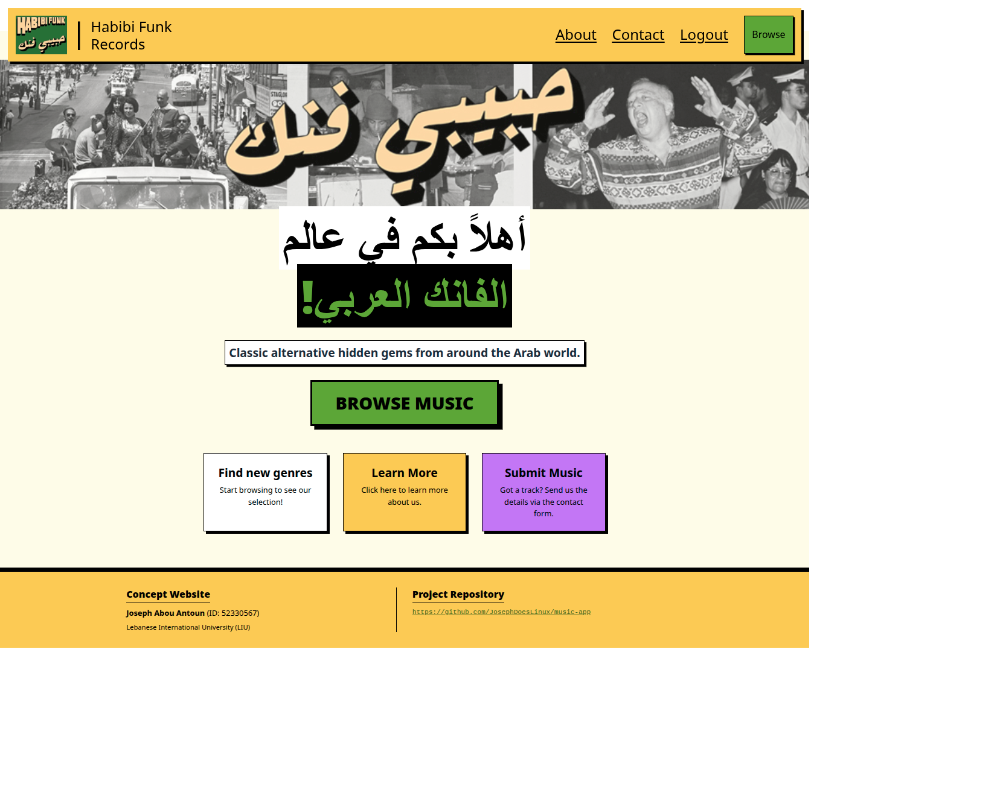
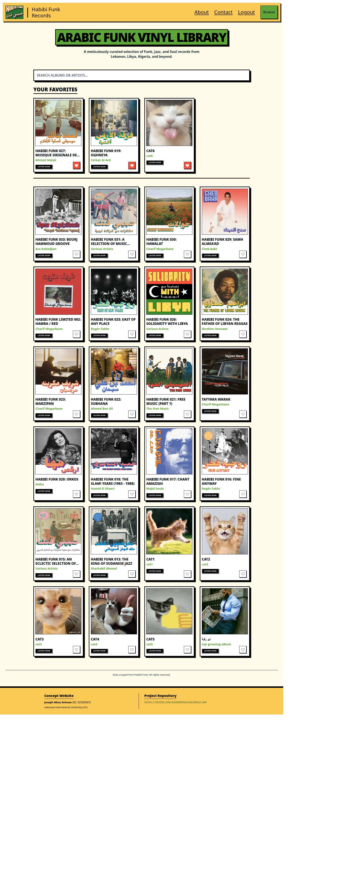
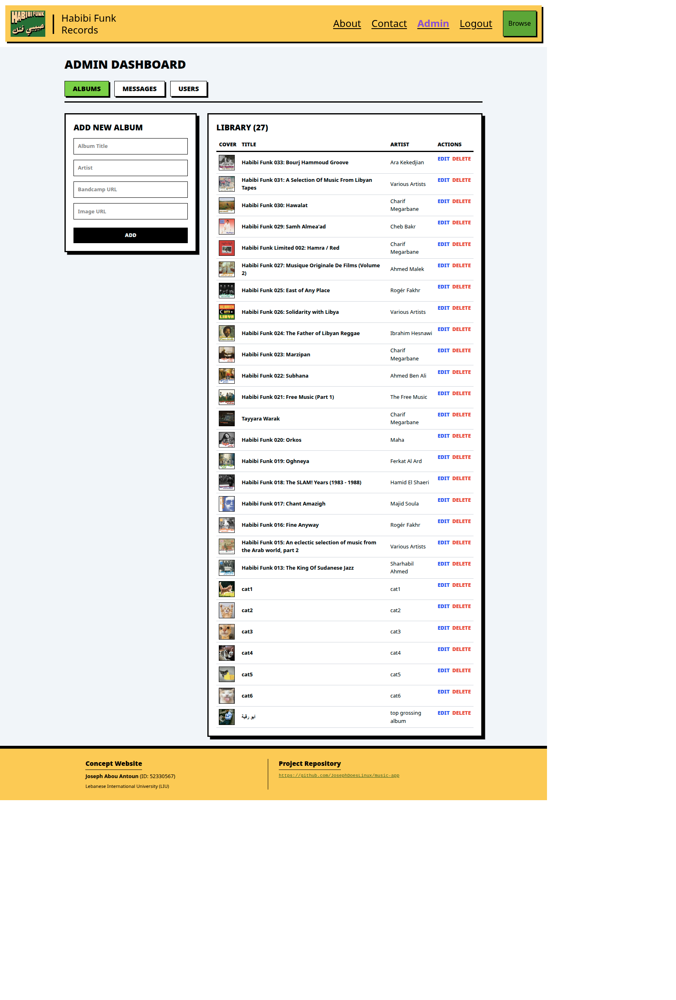

# React +  Vite

# Habibi Punk – Arabic Funk Music Web App

## Project Overview
Habibi Punk is a frontend web application developed for **CSCI426: Advanced Web Programming**.  
It is a music discovery platform that allows users to explore, browse, and learn about underground Arabic funk, jazz, and soul records. The project shows responsive web design, ReactJS frontend development, and UI/UX principles.

**Key Features:**
- Browse curated Arabic funk vinyl albums with album artwork.
- View detailed information about albums and artists.
- About page with label history and cultural context.
- Contact page with a mock contact form.
- Fully responsive design for desktop and mobile.

---

## Technologies Used
- **Frontend:** ReactJS, Tailwind CSS
- **Backend:** NodeJS, PostgreSQL
- **Version Control:** Git & GitHub
- **Deployment:** Render
- **Extra info** Scraped song list from bandcamp using a python script and inspect element.

---

## Setup Instructions

1. **Clone the repository:**
```bash
git clone https://github.com/JosephDoesLinux/music-app.git
```
Then run: 
```bash
npm install => npm run dev
```

---
2. **Clone the backend!**
```bash
git clone https://github.com/JosephDoesLinux/music-backend.git
```
Then run: 
```bash
npm install => npm start
```

---

## Screenshots

### Home Page
<details>
  <summary>📸 Click to view Home Page</summary>
  <br>
  
</details>

### Library Page
<details>
  <summary>📸 Click to view Library Page</summary>
  <br>
  
</details>

### Admin Page (CRUD)
<details>
  <summary>📸 Click to view Admin Page</summary>
  <br>
  
</details>
---

## Live Demo

Check out the live project at: [music-app-eosin-nine.vercel.app/](https://music-app-wark.onrender.com)

---

## Author

Joseph Abou Antoun – 52330567 - Lebanese International University, CSCI426